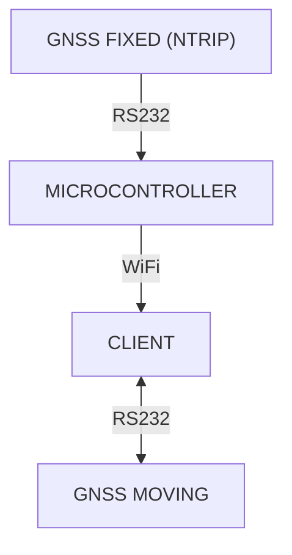

# NTRIP-Client-WiFi-WebSocket

A client to receive NTRIP data over WiFi/WebSocket, forward to GNSS and receive centimeter-level position data from GNSS to write it in file-pipe,
for further processing and visualization. (see [NTRIP-Server](https://github.com/richardreinisch/NTRIP-Server-WiFi-ESP8266))

## How It Works

1. Connect with ESP8266 using WiFi.
2. Start `gnss.py`
3. Position data will be written to `latlon.txt`

> Note: See comments to debug incoming NTRIP data from WebSocket and GPS data (Fix, etc.) from GNSS

> Note: I tested the setup using an [NVIDIA Jetson Nano](https://www.nvidia.com/de-de/autonomous-machines/embedded-systems/) computer which is mounted on my [AI-Car](https://richardreinisch.com/en/dev/ai-car)

> Note: On both ends a [CubePilot](https://www.cubepilot.com/) GNSS is used, one `here3` and one `here3+` both use the u-blox high precision GNSS module `M8P-2`

## Demo

## Architecture

## Legal Information

- This tool uses `websocket-client`, `pyserial`, `pynmeagps`, `pyrtcm`, etc. Refer to their respective licenses for compliance.
- Ensure your use case complies with data protection regulations, particularly when handling sensitive or personal information.
- The authors provide no warranty and assume no liability for any issues arising from the use of this tool.
